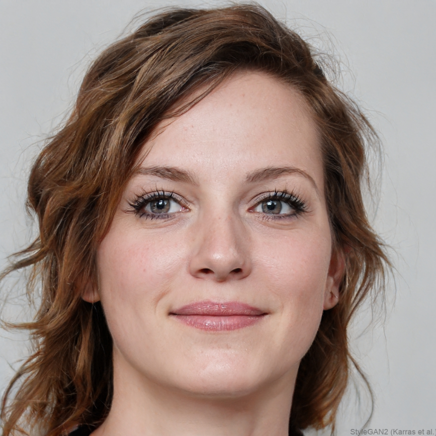

## Make 1: Reverse Engineering an AI Project

### Project

[View This Person Does Not Exist](https://thispersondoesnotexist.com)

---

### What I Made

For this project, I analyzed an AI-generated website that creates realistic images of human faces that do not belong to real people. Instead of building something from scratch, the goal was to reverse engineer how the project works and understand what goes into creating it.

---

### Process

I broke down the project into different parts, including the data, the system, and the human decisions behind it. I looked at what kind of data the AI uses, how the images are generated, and what parts of the process are automated versus controlled by humans.

---

### What I Observed

The AI uses large collections of real human face images as data, likely taken from publicly available sources online. These images are used to train a model that can generate new faces that look realistic. While the image generation itself is automated, humans still decide what data is used, how the model is trained, and what counts as a “realistic” face :contentReference[oaicite:0]{index=0}.

The design of the website also plays a role. The simple layout with one large face makes the output feel more real and personal, even though it is artificially generated.

---

### What Worked

The project is very effective at showing how realistic AI-generated images can be. The faces look believable at first, which creates a strong reaction when you realize they are not real.

---

### What Didn’t Work

Some images had small errors or distortions, such as missing details. It also became clear that the project hides important things, like where the data comes from and the labor behind it.

---

### What I Learned

This project changed how I think about “making.” Instead of directly creating an image, the focus is on building a system that can generate images on its own. This shows that making can include designing tools and processes, not just producing final outputs.

It also showed me that AI is not neutral. Even though the images feel automatic, they are shaped by human decisions about data, design, and what is considered normal or realistic. The clean interface makes the system feel simple, but it hides the complexity behind it.

---

### Reflection

When machines participate in making, we gain speed and scale, since AI can generate many outputs quickly. However, we also lose some transparency, since it becomes harder to see how something was created. This project helped me understand that AI outputs are not just technical results, but are shaped by social, ethical, and design choices.